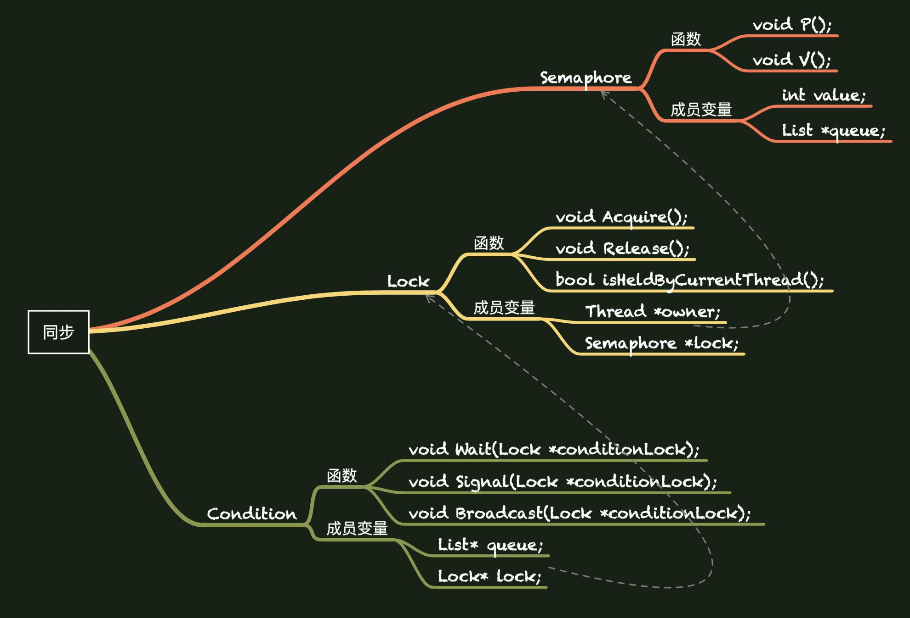
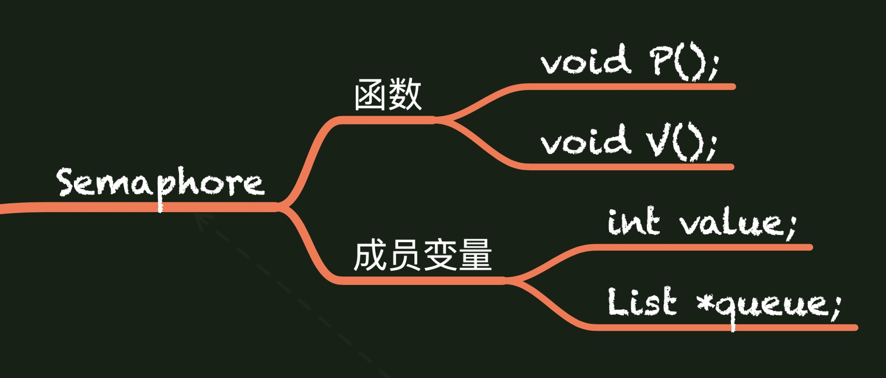

footer: Synchronization
slidenumbers: true

## 同步机制

### threads / synch.h / synch.cc
### threads / synchlist.cc / synchlist.h
#### 刘建东


---


## 第一部分：数据结构





---


## 信号量

---

## 信号量

```cpp
class Semaphore {
  public:
    Semaphore(char* debugName, int initialValue); // 设置初值, 初值不一定为 1
    ~Semaphore();   				// 拆除信号量
    char* getName() { return name;}			// 返回信号量名称, 用于debug
    
    /* 两个核心的原子操作 */
    void P();	  
    void V();
    
  private:
    char* name;        // 信号量名称, 用于debug
    int value;         // 信号量数值, 始终大于等于 0
    List *queue;       // 等待信号量值大于 0 的线程
};
```

---

## 信号量


```cpp
void Semaphore::P()
{
    // 关中断, 保证是原子操作, 某些 OS 中用硬件实现 
    IntStatus oldLevel = interrupt->SetLevel(IntOff); 
    
    while (value == 0) {  // 信号量不可用
    	queue->Append((void *)currentThread); // 添加到信号量的线程等待队列中, 添加到 List 末尾
    	currentThread->Sleep(); // 线程变为阻塞态, 调度程序找到下一个线程运行 
    } 
    value--; 	// 信号量可用, 则消耗信号量
    (void) interrupt->SetLevel(oldLevel); // 开启中断
}
```

+ 此处 while 是否可以替换为 if ？
    + 不可, 需要保证信号量被获取


---


## 信号量

```cpp
void Semaphore::V()
{
    Thread *thread;
    IntStatus oldLevel = interrupt->SetLevel(IntOff); // 关中断

    thread = (Thread *)queue->Remove(); // 提取出 List 首元素, 并从 List 中删去该元素
    if (thread != NULL)	   // 线程变为可运行态
	   scheduler->ReadyToRun(thread);
    value++; // 信号量使用结束则释放
    (void) interrupt->SetLevel(oldLevel); // 开中断
}

```

+ 一个线程使用完的同时将另一个线程从等待队列中移出


---

## 信号量

1. P() 保证当前进程获得信号量才可退出循环
2. V() 使得进程释放信号量的同时, 等待队列首节点被弹出
    



---

## 锁

---

## 锁

```cpp
class Lock {
  public:
    Lock(char* debugName); // 设置初值为 1
    ~Lock();	// 拆除锁
    char* getName() { return name; } // 返回锁名
    
    /* 两个核心原子操作 */
    void Acquire();
    void Release();
    
    /* 判断锁是否由当前进程控制 */
    bool isHeldByCurrentThread();

  private:
    char* name;	
    Thread *owner;      // 锁的拥有者
    Semaphore *lock;    // 利用信号量来实现锁的互斥
};
```

---

## 锁

```cpp
/* 初始化函数, 保证信号量值为 1 */
Lock::Lock(char* debugName) 
{
    name = debugName;
    owner = NULL;
    lock = new Semaphore(name,1);
}

/* 释放锁即表示信号量等待队列为空 */
Lock::~Lock() 
{
    delete lock;
}
```

---

## 锁

```cpp
void Lock::Acquire() 
{
    IntStatus oldLevel = interrupt->SetLevel(IntOff);  // 关中断

    lock->P();              // 等待锁可用
    owner = currentThread;  // 由当前线程掌握这个锁
    (void) interrupt->SetLevel(oldLevel); // 开中断
}
```

+ 信号量操作已经保证为原子操作，此处为何仍需要关中断？两次中断？

---

## 锁

```cpp
void Lock::Release() 
{
    IntStatus oldLevel = interrupt->SetLevel(IntOff);  // 关中断

    ASSERT(currentThread == owner);     // 保证当前进程是锁的拥有者, 即只有拥有者能释放锁
    owner = NULL;   // 将锁拥有者置空
    lock->V();      // 将锁等待队列中第一个线程从阻塞态变成可运行态
    (void) interrupt->SetLevel(oldLevel);
}
```

+ 明确 Release 和 ～Lock 的区别
+ 锁释放，即代表当前线程运行完成
+ 此处是自旋锁还是睡眠锁？为什么要这样设置？

---

## 锁

```cpp
bool Lock::isHeldByCurrentThread()
{
    bool result;
    IntStatus oldLevel = interrupt->SetLevel(IntOff); //关中断

    result = currentThread == owner; //判断部分
    (void) interrupt->SetLevel(oldLevel); //开中断
    return(result);
}
```

+ 为什么此处需要关中断，而之前的 ASSERT 部分不需要关中断？且既然 ASSERT 已经可以判断，为何还需要该函数？
    + 私有成员不可直接访问

---

## 锁

1. Acquire() 当前线程获得锁才可退出循环, 但不是忙等待
2. Release() 只有锁的拥有线程才能释放锁, 将锁等待队列第一个线程置为可运行态
3. 锁和初始值为 1 的信号量的区别？    
    + 锁只能由持有者释放，信号量可由任何进程修改

    
    
---

## 条件变量

---

## 条件变量

```cpp
class Condition {
  public:
    Condition(char* debugName); // 初始化, 队列为空, 锁为空
    ~Condition();			// 拆除条件变量
    char* getName() { return (name); }
    
    /* 三个操作都必须保证锁由当前线程拥有 */
    void Wait(Lock *conditionLock); 
    void Signal(Lock *conditionLock);
    void Broadcast(Lock *conditionLock);

  private:
    char* name;
    List* queue;  // 条件变量等待队列
    Lock* lock;   // 条件变量是对锁的进一步封装
};
```

---

## 条件变量

```cpp
Condition::Condition(char* debugName) 
{ 
    name = debugName;
    queue = new List;
    lock = NULL;
}

Condition::~Condition() 
{ 
    delete queue;
}
```

+ 为什么只 delete queue, 不 delete lock ?
    + lock 变量不在此处声明

---

## 条件变量
```cpp
void Condition::Wait(Lock* conditionLock) 
{
    IntStatus oldLevel = interrupt->SetLevel(IntOff); // 关中断

    ASSERT(conditionLock->isHeldByCurrentThread());  // 检查锁是否被当前线程拥有，同时说明了该函数的作用
    if(queue->IsEmpty()) {
	   lock = conditionLock;  // 对条件变量的锁赋值
    } 
    ASSERT(lock == conditionLock); // 保证操作的同一个锁
    queue->Append(currentThread);  // 将当前线程加入到当前条件变量的等待队列中
    conditionLock->Release();      // 拥有者被加入等待队列，因此释放锁
    currentThread->Sleep();        // 当前进程被阻塞
    conditionLock->Acquire();      // 将锁对应的信号量的等待队列中的一个线程激活
    (void) interrupt->SetLevel(oldLevel); // 开中断
}
```
+ 信号量队列和条件变量队列区别？（当前线程）


---

## 条件变量
```cpp
void Condition::Signal(Lock* conditionLock) 
{ 
    Thread *nextThread;
    IntStatus oldLevel = interrupt->SetLevel(IntOff); // 关中断

    ASSERT(conditionLock->isHeldByCurrentThread()); // 该锁由当前线程拥有
    if(!queue->IsEmpty()) { // 条件变量等待队列不为空
    	ASSERT(lock == conditionLock); // 两个锁相同
    	nextThread = (Thread *)queue->Remove(); // 移出队首
    	scheduler->ReadyToRun(nextThread);      // 将线程状态置为可运行态
    } 
    (void) interrupt->SetLevel(oldLevel); // 开中断
}
```

+ 调度队首线程

---

## 条件变量
```cpp
void Condition::Broadcast(Lock* conditionLock) 
{ 
    Thread *nextThread;
    IntStatus oldLevel = interrupt->SetLevel(IntOff); // 关中断

    ASSERT(conditionLock->isHeldByCurrentThread()); // 当前锁由当前线程控制
    if(!queue->IsEmpty()) { // 等待队列不为空
    	ASSERT(lock == conditionLock);
    	while(nextThread = (Thread *)queue->Remove()) {
    	    scheduler->ReadyToRun(nextThread);  // 将等待队列中的所有线程置为可运行态
    	}
    } 
    (void) interrupt->SetLevel(oldLevel); // 开中断
}
```
+ 唤醒等待队列中所有线程

---

## 三个数据结构的差别总结

---

## 信号量、锁、条件变量总结

1. 互斥锁必须是谁上锁就由谁来解锁，而信号量的 P() 和 V() 操作不必由同一个线程执行。
2. 互斥锁要么被锁住，要么被解开，和二值信号量类似。
3. 互斥锁是为上锁而优化的；条件变量是为等待而优化的；前两者底层都是信号量实现，因此信号量既可用于上锁，也可用于等待，会有更多的开销和更高的复杂性。

---

## 信号量、锁、条件变量总结

1. 互斥锁，条件变量都只用于同一个进程的各线程间，而信号量可用于不同进程间的同步。当信号量用于进程间同步时，要求信号量建立在共享内存区。
2. 信号量有计数值，每次信号量 V() 操作都会被记录，而条件变量在发送信号时，如果没有线程在等待该条件变量，那么信号将丢失。

---

## 二、SynchList

---

## SynchList

+ 实现了普通List中的主要函数, 由lock来使List操作互斥, 由listEmpty来判断List是否为空

```cpp
class SynchList {
  public:
    SynchList();
    ~SynchList();

    void Append(void *item);
    void *Remove();
    void Mapcar(VoidFunctionPtr func); // 对list中每个线程实施函数

  private:
    List *list;	
    Lock *lock;			// 互斥锁
    Condition *listEmpty;	// 队列为空的条件变量
};
```

---

## SynchList

```cpp
class SynchList {
  public:
    SynchList();
    ~SynchList();
1. 
    void Append(void *item);
    void *Remove();
    void Mapcar(VoidFunctionPtr func); // 对list中每个线程实施特定操作

  private:
    List *list;	
    Lock *lock;			// 互斥锁
    Condition *listEmpty;	// 队列为空的条件变量
};
```

---

## SynchList

```cpp
void SynchList::Append(void *item)
{
    lock->Acquire();		// List 的操作是互斥的
    list->Append(item);
    listEmpty->Signal(lock);	// 唤醒 Remove 中的等待
    lock->Release();
}

void SynchList::Mapcar(VoidFunctionPtr func)
{ 
    lock->Acquire(); 
    list->Mapcar(func);
    lock->Release(); 
}

```

---

## SynchList

```cpp
void * SynchList::Remove()
{
    void *item;

    lock->Acquire();			// List 操作互斥
    while (list->IsEmpty())
    	listEmpty->Wait(lock);	// 直到 List 不为空
    item = list->Remove();
    ASSERT(item != NULL);
    lock->Release();
    return item;
}
```

---

## Q&A

---

## 感谢聆听！
